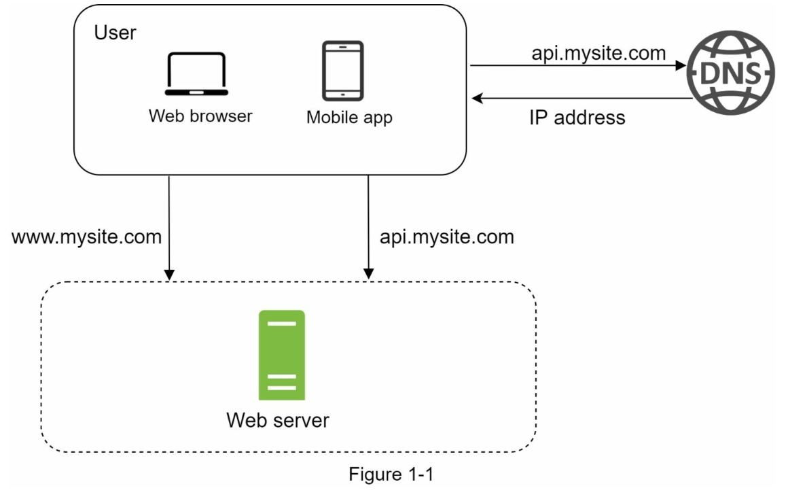
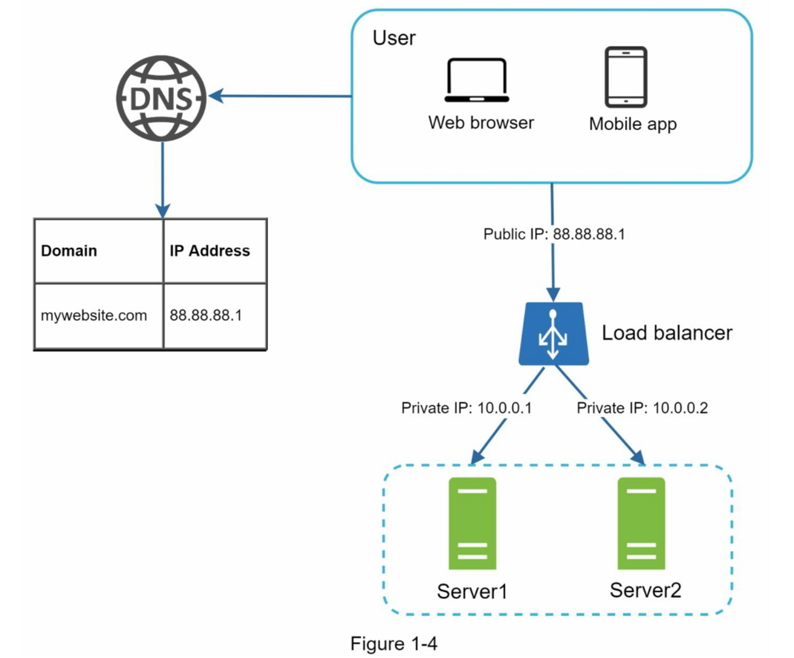

# Chapter 01：從單一伺服器擴充到資料庫與快取

## 架構演進

```text
Stage 01：單一 Web Server
    ↓
Stage 02：Load Balancer + 多台 Web Server
    ↓
Stage 03：Database Primary + Replicas（讀寫分離）
    ↓
Stage 04：Shared Cache（Cache-Aside）
```

| Stage | 程式 | 架構決策 | 狀態 |
| --- | --- | --- | --- |
| 01 | [`stage01_single_server.py`](./src/stage01_single_server.py) | [`001-single-server.md`](./decisions/001-single-server.md) | 已完成 |
| 02 | [`stage02_load_balancer.py`](./src/stage02_load_balancer.py) | [`002-load-balancer.md`](./decisions/002-load-balancer.md) | 已完成 |
| 03 | [`stage03_database_replication.py`](./src/stage03_database_replication.py) | [`003-database-replication.md`](./decisions/003-database-replication.md) | 已完成 |
| 04 | [`stage04_cache.py`](./src/stage04_cache.py) | [`004-cache.md`](./decisions/004-cache.md) | 已完成 |

## 目標

本章從最簡單的單一 Web Server 開始，逐步加入 Load Balancer、多台 Web Servers、Database Replication 與 Shared Cache，觀察系統如何擴充並理解一致性取捨。

Stage 01 的目標是理解使用者輸入網域後，如何經過 DNS、TCP 與 HTTP，直接從單一 Web Server 取得 HTML。

Stage 02 的目標是理解 DNS 如何改為指向 Load Balancer 的 Public IP，以及 Load Balancer 如何透過 Health Check 與 Round Robin，將 Request 轉送給具有 Private IP 的健康 Web Server。這個階段也會區分 Client 到 Load Balancer，以及 Load Balancer 到 Web Server 的兩段 TCP 連線。

Stage 03 加入 Database Primary、Replicas 與讀寫分離，Stage 04 再以 Cache-Aside 降低重複的 Database 讀取，並觀察 Cache TTL 與 Replication Lag 對舊資料的影響。

## 系統架構

### Stage 01：單一 Web Server



圖中的 Web Browser 或 Mobile App 先向 DNS 查詢網域名稱，取得本章假設的 IP 位址 `15.125.23.214`，之後再連線至同一台 Web Server。Web Browser 請求網站內容，Mobile App 則通常透過 API 存取服務。

```text
Client -> DNS -> Single Web Server Public IP
```

此時 Web Server 同時是公開流量入口與 Request 處理者，因此它的容量限制和故障都會直接影響整個服務。

### Stage 02：Load Balancer + 多台 Web Servers



圖 2 在使用者與 Web Servers 之間加入 Load Balancer。DNS 不再回傳某一台 Web Server 的 IP，而是回傳 Load Balancer 的 Public IP。使用者只會連線 Load Balancer，不會取得或直接連線後方 Server 的 Private IP。

```text
Client -> DNS -> Load Balancer Public IP
                     -> Web Server 1 Private IP
                     -> Web Server 2 Private IP
```

圖中的 `mywebsite.com`、`88.88.88.1`、`10.0.0.1` 與 `10.0.0.2` 是架構示意值；本章程式使用的對應值如下：

```text
www.mysite.com -> Load Balancer 15.125.23.214:80
Load Balancer  -> Web Server 1 10.0.1.11:80
               -> Web Server 2 10.0.1.12:80
               -> Web Server 3 10.0.1.13:80
```

圖 1 到圖 2 的關鍵演進，是將「公開流量入口」從單一 Web Server 移到 Load Balancer，並讓後方 Web 層可以增加或移除 Server。

## 完整運作流程

Stage 01 與 Stage 02 的 Client 操作相同：使用者輸入網域並等待頁面回傳。架構演進發生在 DNS 指向、TCP 連線終點與 Server 選擇方式；以下沿著同一個 Request 流程比較兩個階段。

### 1. 使用者輸入網址

假設使用者在瀏覽器輸入：

```text
http://www.mysite.com/index.html
```

瀏覽器會解析出：

- Protocol：`http`
- Domain：`www.mysite.com`
- Path：`/index.html`
- Port：`80`（HTTP 預設值）

### 2. DNS 解析網域名稱

瀏覽器需要先將容易閱讀的網域名稱轉換成電腦可連線的 IP 位址：

```text
www.mysite.com → 15.125.23.214
```

瀏覽器與作業系統會先檢查 DNS 快取。如果沒有找到紀錄，才會向 DNS Resolver 查詢。DNS 回應會包含 IP 位址與 TTL；TTL 決定這筆結果可以被快取多久。

在本章的模擬中，不實作真正的 DNS 查詢，而是由 DNS 元件直接回傳固定 IP：

```text
15.125.23.214
```

兩個階段使用相同的網域與示意 Public IP，但 IP 所代表的元件不同：

```text
Stage 01：www.mysite.com -> 單一 Web Server 15.125.23.214
Stage 02：www.mysite.com -> Load Balancer   15.125.23.214
```

進入 Stage 02 後，DNS 不會把 `10.0.1.11`、`10.0.1.12` 或 `10.0.1.13` 等 Web Server Private IP 回傳給 Client。

### 3. 建立 TCP 連線

取得 IP 後，瀏覽器會連線至：

```text
15.125.23.214:80
```

Stage 01 中，這條 TCP 連線直接終止在單一 Web Server。Stage 02 中，第一段 TCP 連線改為終止在 Load Balancer：

```text
Stage 01：Client -> Web Server Public IP
Stage 02：Client -> Load Balancer Public IP
```

HTTP/1.1 使用 TCP 傳輸。傳送 HTTP Request 前，Client 與 Server 會先完成 TCP 三向交握：

```text
Browser                    Connection Destination
   │ -------- SYN -----------------> │
   │ <------- SYN + ACK ------------ │
   │ -------- ACK -----------------> │
```

Stage 01 的 Connection Destination 是 Web Server；Stage 02 的第一段連線目的地則是 Load Balancer。

TCP 負責可靠傳輸，確保資料依序抵達，並在封包遺失時重新傳送。

### 4. 發送 HTTP Request

連線建立後，瀏覽器發送 HTTP Request：

```http
GET /index.html HTTP/1.1
Host: www.mysite.com
Accept: text/html
Connection: keep-alive
```

Stage 01 由 Web Server 直接接收這個 Request；Stage 02 則先由 Load Balancer 接收。對 Client 而言，HTTP Request 不需要因後方增加多台 Servers 而改變。

其中：

- `GET` 表示讀取資源。
- `/index.html` 是要求的資源路徑。
- `Host` 表示目標網域。
- `Accept` 表示 Client 希望收到 HTML。
- `Connection: keep-alive` 表示完成這次請求後，可暫時保留 TCP 連線供後續請求使用。

### 5. 選擇並由 Web Server 處理請求

Stage 01 沒有選擇步驟，唯一的 Web Server 直接處理 Request。

Stage 02 的 Load Balancer 會先以 `/health` 排除不健康的 Backend，再使用 Round Robin 選擇一台健康 Server：

```text
Request 1 -> Web Server 1
Request 2 -> Web Server 2
Request 3 -> Web Server 3
```

假設選到 Web Server 2，Load Balancer 會建立第二段 TCP 連線，透過 Private Network 轉送 Request：

```text
第一段：Client        -> Load Balancer 15.125.23.214:80
第二段：Load Balancer -> Web Server 2  10.0.1.12:80
```

Public IP 與 Private IP 不會合併成一個位址。它們分別是兩段連線的目的地。

Web Server 在 Port `80` 監聽連線。收到資料後會：

1. 接受 TCP 連線。
2. 解析 HTTP Method、Path 與 Headers。
3. 檢查請求方法是否支援。
4. 將 `/index.html` 對應到伺服器上的靜態檔案。
5. 讀取檔案內容。
6. 建立 HTTP Response。

路徑對應可以簡化成：

```text
GET /            → index.html
GET /index.html  → index.html
其他路徑          → 404 Not Found
```

### 6. 回傳 HTTP Response

Stage 01 中，Web Server 將 Response 直接傳回 Client；Stage 02 則由選中的 Web Server 先傳回 Load Balancer，再由 Load Balancer 傳回 Client：

```text
Stage 01：Web Server -> Client
Stage 02：Web Server -> Load Balancer -> Client
```

Stage 02 的 Client 不需要知道實際由哪台 Web Server 處理。模擬程式會在 Response 加入 `X-Served-By` Header，純粹用來觀察 Round Robin 的分配結果。

找到檔案後，Server 回傳狀態碼、Headers 與 HTML：

```http
HTTP/1.1 200 OK
Content-Type: text/html; charset=utf-8
Content-Length: 79
Connection: keep-alive

<!doctype html>
<html>
  <body>
    <h1>Hello World</h1>
  </body>
</html>
```

HTTP Response 包含三個部分：

1. Status Line：例如 `HTTP/1.1 200 OK`。
2. Response Headers：描述內容類型、大小與連線方式。
3. Response Body：本次回傳的 HTML。

如果要求的檔案不存在，Server 應回傳：

```http
HTTP/1.1 404 Not Found
Content-Type: text/html; charset=utf-8

<h1>404 Not Found</h1>
```

### 7. 瀏覽器顯示 HTML

瀏覽器收到 Response 後會：

1. 根據狀態碼判斷請求是否成功。
2. 根據 `Content-Type` 判斷內容為 HTML。
3. 解析 HTML 並建立 DOM。
4. 計算頁面版面並繪製畫面。

如果 HTML 還引用 CSS、JavaScript 或圖片，瀏覽器會為每個資源繼續發送 HTTP Request。本章暫時只回傳單一 HTML，因此不模擬額外資源。

## Stage 01：單一伺服器的責任

這個架構中，唯一的 Web Server 同時負責：

- 接受所有使用者連線。
- 解析所有 HTTP Requests。
- 儲存並讀取靜態 HTML。
- 建立並回傳 HTTP Responses。
- 處理錯誤，例如不存在的路徑。

它的優點是架構簡單、容易理解與部署；缺點是伺服器一旦故障，整個服務就無法使用，而且 CPU、記憶體、網路頻寬與連線數都受限於單一機器。

## Stage 01 模擬範圍

第一版程式預計模擬：

- DNS 將 `example.com` 解析為固定 IP `15.125.23.214`。
- Browser 建立 `GET /index.html` Request。
- Web Server 解析 Request。
- Web Server 根據路徑讀取靜態 HTML。
- 成功時回傳 `200 OK` 與 HTML。
- 路徑不存在時回傳 `404 Not Found`。
- Browser 顯示 Response 狀態與 HTML。

第一版暫不處理：

- 真實 DNS 網路查詢。
- HTTPS 與 TLS。
- Database。
- Cache。
- Load Balancer。
- 多台 Web Servers。
- CSS、JavaScript 與圖片等額外資源。

核心資料流為：

```text
Domain → DNS → IP → TCP Connection → HTTP Request
       → Web Server → HTTP Response → HTML
```

## 執行最小模擬程式

本章的 [`stage01_single_server.py`](./src/stage01_single_server.py) 使用 Python 標準函式庫模擬完整流程，不需要安裝額外套件。

```powershell
cd "CHAPTER 01：SCALE FROM ZERO TO MILLIONS OF USERS"
python src/stage01_single_server.py
```

程式中的 `15.125.23.214` 是系統架構所假設的公開 IP。因為這個 IP 並未配置在開發電腦上，實際的本機 TCP 連線會映射到 `127.0.0.1:8080`。

程式執行時會依序顯示：

1. DNS 將 `www.mysite.com` 解析為 `15.125.23.214`。
2. Browser 與 Web Server 建立 TCP 連線。
3. Browser 發送 `GET /index.html`。
4. Web Server 回傳 `200 OK` 與 HTML。
5. Browser 顯示收到的狀態和 HTML。

## 執行 Load Balancer 模擬程式

```powershell
python src/stage02_load_balancer.py
```

Stage 02 會啟動三台本機 Web Server 與一個 Load Balancer，連續發出六個 Request。前三次使用 Round Robin 分配至 Server 1、2、3；接著模擬 Server 2 離線，確認後續 Request 只會送往通過 Health Check 的 Server 1 與 Server 3。完整設計與預期輸出請參考 [002 Load Balancer 架構決策](./decisions/002-load-balancer.md)。

## 執行 Database Replication 模擬程式

```powershell
python src/stage03_database_replication.py
```

Stage 03 保留三台 Web Server 與 Load Balancer，並加入一台 Database Primary 和兩台 Replicas。程式會先寫入 Primary，再分別於複製前後讀取 Replica，以觀察 replication lag 造成的「找不到資料」或「讀到舊值」。完整流程請參考 [003 Database Replication 架構決策](./decisions/003-database-replication.md)。

## 執行 Shared Cache 模擬程式

```powershell
python src/stage04_cache.py
```

Stage 04 使用所有 Web Servers 共用的 Cache，依序展示 Cache Miss、Cache Set、Cache Hit、寫入後 Invalidation，以及 TTL 到期。模擬也會刻意讓落後的 Replica 將舊資料放回 Cache，以觀察 Cache 如何延長 Replication Lag 的影響。完整流程請參考 [004 Shared Cache 架構決策](./decisions/004-cache.md)。

## 延伸閱讀

- [術語表](./glossary.md)
- [DNS 筆記](./notes/01-dns.md)
- [TCP 筆記](./notes/02-tcp.md)
- [HTTP 筆記](./notes/03-http.md)
- [Load Balancer 筆記](./notes/04-load-balancer.md)
- [Database Replication 筆記](./notes/05-database-replication.md)
- [Database Read/Write Splitting 筆記](./notes/06-database-read-write-splitting.md)
- [Cache 筆記](./notes/07-cache.md)
- [Cache-Aside 筆記](./notes/08-cache-aside.md)
- [網域註冊與 IP 對應](./questions/01-domain-registration.md)
- [`www` 與 `api` 子網域的用途](./questions/02-www-and-api.md)
- [除了 Round Robin，Load Balancer 如何分配伺服器？](./questions/03-load-balancing-algorithms.md)
- [正常系統只有一台 Primary 嗎？](./questions/04-single-primary-vs-multi-primary.md)
- [Primary 更新時為何不等待所有 Replicas？](./questions/05-synchronous-vs-asynchronous-replication.md)
- [Database Primary 故障時怎麼辦？](./questions/06-database-primary-failure.md)
- [Redis、Memcached 與 Shared Cache 是什麼？](./questions/07-redis-memcached-and-shared-cache.md)
- [Cache TTL 是什麼？應該設定多久？](./questions/08-how-to-choose-cache-ttl.md)
- [Database 更新後，Cache 應該更新還是刪除？](./questions/09-cache-invalidation-and-stale-data.md)
- [單一伺服器架構決策](./decisions/001-single-server.md)
- [Load Balancer 架構決策](./decisions/002-load-balancer.md)
- [Database Replication 架構決策](./decisions/003-database-replication.md)
- [Shared Cache 架構決策](./decisions/004-cache.md)
